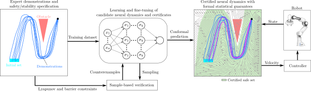

# Safe and Stable Neural Network Dynamical Systems for Robot Motion Planning

Official implementation accompanying the paper **Safe and Stable Neural Network Dynamical Systems for Robot Motion Planning** (*S2-NNDS*) accepted at IEEE Robotics and Automation Letters(RA-L).

> [**Safe and Stable Neural Network Dynamical Systems for Robot Motion Planning**](https://arxiv.org/abs/2511.20593),  
> Allen Emmanuel Binny<sup>\*</sup>, Mahathi Anand<sup>\*</sup>, Hugo T. M. Kussaba, Lingyun Chen, Shreenabh Agrawal, Fares J. Abu-Dakka, Abdalla Swikir  
> *IEEE Robotics and Automation Letters (RA-L)*  
> *Preprint available on arXiv ([arXiv:2511.20593](https://arxiv.org/abs/2511.20593))*

### [Paper](https://arxiv.org/abs/2511.20593) | [YouTube](https://www.youtube.com/watch?v=qMAGGjSJt9Q) 

## Abstract
Learning safe and stable robot motions from demonstrations remains a challenge, especially in complex, nonlinear tasks involving dynamic, obstacle-rich environments. In this paper, we propose Safe and Stable Neural Network Dynamical Systems S2-NNDS, a learning-from-demonstration framework that simultaneously learns expressive neural dynamical systems alongside neural Lyapunov stability and barrier safety certificates. Unlike traditional approaches with restrictive polynomial parameterizations, S2-NNDS leverages neural networks to capture complex robot motions providing probabilistic guarantees through split conformal prediction in learned certificates. Experimental results on various 2D and 3D datasets—including LASA handwriting and demonstrations recorded kinesthetically from the Franka Emika Panda robot— validate S2-NNDS effectiveness in learning robust, safe, and stable motions from potentially unsafe demonstrations.

## Installation

### System Requirements
- Ubuntu 20.04/22.04 or Windows 10/11
- NVIDIA GPU with CUDA 11.8+ (optional but recommended)


## Install

### Create Conda Environment
 ```sh
conda create --name <your_env_name> python=3.8

conda activate <your_env_name>
 ```

### Install Dependencies
``` sh
pip3 install torch torchvision torchaudio --index-url https://download.pytorch.org/whl/cu118

pip install termcolor scipy matplotlib onnx numpy pandas pyrallis pyLasaDataset tqdm 
```

## Datasets

1. **LASA Dataset**: This dataset is obtained directly from [pyLasaDataset](https://github.com/justagist/pyLasaDataset)

    We have tested and stored the models for the following datasets:
    
    - Angle
    - CShape
    - GShape
    - NShape
    - Sine
    - Sshape
    - Worm
    - PShape

2. **2D Dataset**: This 2D-dataset is robot trajectory directly obtained from robot demonstration of a Franka Emika Panda. This dataset has the following type which has been tested:
    - Five_Obstacle_DS
3. **3D Dataset**: This 3D-dataset is obtained directly from [ds-opt](https://github.com/nbfigueroa/ds-opt) 

    We have tested for the following datasets: 
    - 3D_CShape_bottom

## Quick Start

### Training Models

#### LASA Dataset
```bash
python main.py --dataset_type=LASA 
```

#### Robot Demonstration [2D Dataset]
```bash
python main.py --dataset_type=2DShapes 
```

#### 3D Dataset
```bash
python main.py --dataset_type=3DShapes
```


## Running the Code

### Training new models
For training the models for the dynamical system and the certificates we can run the following command.

1. To use the **LASA Dataset**, run the following command:
    ```bash 
    python main.py --dataset_type=lasa --lasa_name=<name_from_dataset>
    ```

2. To use the **2D Dataset**, run the following command:
    ```bash
    python main.py --dataset_type=2D_Shapes --name_2d=<name_from_dataset>
    ```

3. To use the **3D Dataset**, run the following command:
    ```bash
    python main.py --dataset_type=3D_Shapes --name_3d=<name_from_dataset>
    ```

The hyperparameters for the config files can be changed by changing the parameters in the `config_files/<dataset_type>/<dataset_name>_config.json`

The verified models are stored in the `models` folder. We also have the `models_onnx` folder to store the onnx models for the dynamical system to be implemented on a Franka Panda robot arm.

### Visualising the Plots

The plots of the dynamical systems are stored in the `results` folder.

Use the arguments for `--dataset_type` and the name of the dataset as per shown above. Run the following command

```bash
python results_visualisation.py 
```

The models for these visulisation is found in the `models_verified` folder. Plese edit these models carefully. 


### Validating the Results

For obtaining the MSE and SD for the errors, you can run the following command with the arguments corresponding to the dataset

```bash
python evaluate_s2nnds_results.py --dataset_type=<data_set>
```
As shown in the paper, the comparisions between *S2NN-DS* and *ABC-DS* are observable for some of the shapes in the LASA dataset. For all the datasets, you will obtain the statistical measurements of MSE, SD, DTW and Safe Area in Workspace corresponding to *S2NN-DS*.
## Benchmarking Results
The benchmarking has been performed for the followign LASA Datasets:
- Worm
- PShape
- Sshape
- Sine
### ABC-DS Polynomials
We use this [code](https://github.com/martinschonger/abc-ds) using [PENBMI](http://www.penopt.com/penbmi.html) solver (obtained official license) for fair comparisions. All the experiments were run on the same PC with  Ubuntu 20.04LTS system with 16GB RAM equipped with NVIDIA GeForce RTX 4050 - 6GB GPU. The config file containing these polynomials are stored in the folder `abc_ds_config`.

### Validating the Results

For obtaining the MSE and SD for the errors, the DTW or the safe area computation in the workspace and compare it with the results with *ABC-DS*, you can run the following command with the arguments corresponding to the dataset

```bash
python evaluate_benchmark_results.py --lasa_name=<name_of_dataset>
```

### Plotting the Results

The plots of the trajectories of *S2NN-DS*  and *ABC-DS* are stored in the `results` folder.

To plot theses results, run the following code with the required arguments:
```bash
python benchmark_plot.py --lasa_name=<name_of_dataset>
```

## Additional Files
Please find in `resources\training_parameters.pdf` the document containing dataset description, initial set parameters, training parameters, training time and obstacle configurations used for *S2NN-DS*, *ABC-DS*.
## Contact
If there are any comments or questions please do feel to reach out to us!

Allen Emmanuel Binny : allenebinny@kgpian.iitkgp.ac.in

## Citations

If you found this project useful or relevant to your research, please consider citing :)
```
@misc{binny2025safestableneuralnetwork,
      title={Safe and Stable Neural Network Dynamical Systems for Robot Motion Planning}, 
      author={Allen Emmanuel Binny and Mahathi Anand and Hugo T. M. Kussaba and Lingyun Chen and Shreenabh Agrawal and Fares J. Abu-Dakka and Abdalla Swikir},
      year={2025},
      eprint={2511.20593},
      archivePrefix={arXiv},
      primaryClass={cs.RO},
      url={https://arxiv.org/abs/2511.20593}, 
}
```