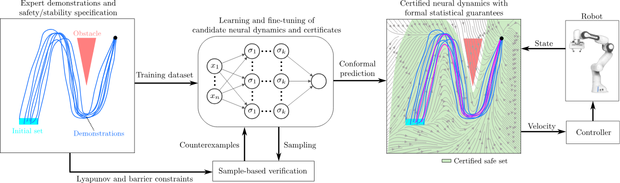

# Safe and Stable Neural Network Dynamical Systems for Robot Motion Planning

Official implementation accompanying the paper **Safe and Stable Neural Network Dynamical Systems for Robot Motion Planning** (*S2-NNDS*) accepted for publication at IEEE Robotics and Automation Letters(RA-L).

> [**Safe and Stable Neural Network Dynamical Systems for Robot Motion Planning**](https://ieeexplore.ieee.org/abstract/document/11358683),  
> Allen Emmanuel Binny<sup>\*</sup>, Mahathi Anand<sup>\*</sup>, Hugo T. M. Kussaba, Lingyun Chen, Shreenabh Agrawal, Fares J. Abu-Dakka, Abdalla Swikir  
> *IEEE Robotics and Automation Letters (RA-L)* > *DOI: [10.1109/LRA.2025.3533860](https://doi.org/10.1109/LRA.2025.3533860)* | *Preprint available on [arXiv:2511.20593](https://arxiv.org/abs/2511.20593)*
### [PAPER (IEEE Xplore)](https://ieeexplore.ieee.org/abstract/document/11358683) | [ARXIV](https://arxiv.org/abs/2511.20593) | [YouTube](https://youtu.be/YJjCOua2puA)

## Abstract
Learning safe and stable robot motions from demonstrations remains a challenge, especially in complex, nonlinear tasks involving dynamic, obstacle-rich environments. In this paper, we propose Safe and Stable Neural Network Dynamical Systems S2-NNDS, a learning-from-demonstration framework that simultaneously learns expressive neural dynamical systems alongside neural Lyapunov stability and barrier safety certificates. Unlike traditional approaches with restrictive polynomial parameterizations, S2-NNDS leverages neural networks to capture complex robot motions providing probabilistic guarantees through split conformal prediction in learned certificates. Experimental results on various 2D and 3D datasets—including LASA handwriting and demonstrations recorded kinesthetically from the Franka Emika Panda robot— validate S2-NNDS effectiveness in learning robust, safe, and stable motions from potentially unsafe demonstrations.

## Installation

### System Requirements
- Ubuntu 20.04 / 22.04 (recommended)
- Python 3.8
- NVIDIA GPU with CUDA ≥ 11.8 (optional, required for faster training)

### Create Conda Environment
```sh
conda create -n s2nnds python=3.8
conda activate s2nnds
``` 

### Install Dependencies
``` sh
pip install torch torchvision torchaudio --index-url https://download.pytorch.org/whl/cu118
pip install termcolor scipy matplotlib onnx numpy pandas pyrallis pyLasaDataset tqdm
```
## Datasets
The experiments in the paper are conducted on the following datasets:
### 1. LASA Dataset
Obtained via [pyLasaDataset](https://github.com/justagist/pyLasaDataset).

Evaluated shapes:
- Angle, CShape, GShape, NShape
- Sine, Sshape, Worm, PShape

### 2. 2D Robot Demonstration Dataset
Collected from kinesthetic demonstrations on a **Franka Emika Panda** robot.
Evaluated task:
- Five_Obstacle_DS

### 3. 3D Dataset
Obtained from [ds-opt](https://github.com/nbfigueroa/ds-opt).

Evaluated task:
- 3D_CShape_bottom


## Quick Start

### Training Models

#### LASA Dataset
```bash
python main.py --dataset_type=LASA 
```

#### Robot Demonstration [2D Dataset]
```bash
python main.py --dataset_type=2DShapes 
```

#### 3D Dataset
```bash
python main.py --dataset_type=3DShapes
```


## Running the Code

### Training new models
For training the models for the dynamical system and the certificates we can run the following command.

1. To use the **LASA Dataset**, run the following command:
    ```bash 
    python main.py --dataset_type=lasa --lasa_name=<name_from_dataset>
    ```

2. To use the **2D Dataset**, run the following command:
    ```bash
    python main.py --dataset_type=2D_Shapes --name_2d=<name_from_dataset>
    ```

3. To use the **3D Dataset**, run the following command:
    ```bash
    python main.py --dataset_type=3D_Shapes --name_3d=<name_from_dataset>
    ```

The hyperparameters for the config files can be changed by changing the parameters in the `config_files/<dataset_type>/<dataset_name>_config.json`

The verified models are stored in the `models` folder. We also have the `models_onnx` folder to store the onnx models for the dynamical system to be implemented on a Franka Panda robot arm.

### Visualizing the Results

The plots of the dynamical systems are stored in the `results` folder.

Use the arguments for `--dataset_type` and the name of the dataset as per shown above. Run the following command

```bash
python results_visualisation.py 
```

The models for these visulisation is found in the `models_verified` folder. Plese edit these models carefully. 

For obtaining the MSE and SD for the errors, the DTW or the safe area computation in the workspace and compare it with the results with *ABC-DS*, you can run the following command with the arguments corresponding to the dataset

```bash
python evaluate_s2nnds_results.py --dataset_type=<data_set>
```
## Benchmarking Results

Benchmarking is performed on the following LASA datasets:
- Worm
- PShape
- Sshape
- Sine

### ABC-DS Polynomials
ABC-DS baselines are generated using the official implementation [abc-ds](https://github.com/martinschonger/abc-ds) with the PENBMI solver (official license).

All experiments are conducted on the same machine:
- Ubuntu 20.04 LTS
- 16 GB RAM
- NVIDIA GeForce RTX 4050 (6 GB)

The config file containing these polynomials are stored in the folder `abc_ds_config`.

### Visualizing the Results

The plots of the trajectories of *S2NN-DS*  and *ABC-DS* are stored in the `results` folder.

To plot theses results, run the following code with the required arguments:
```bash
python benchmark_plot.py --lasa_name=<name_of_dataset>
```

For obtaining the MSE and SD for the errors, the DTW or the safe area computation in the workspace and compare it with the results with *ABC-DS*, you can run the following command with the arguments corresponding to the dataset

```bash
python evaluate_benchmark_results.py --lasa_name=<name_of_dataset>
```

## Additional Files
Please find in `resources\training_parameters.pdf` the document containing dataset description, initial set parameters, training parameters, training time and obstacle configurations used for *S2NN-DS*, *ABC-DS*.
## Contact
If there are any comments or questions please do feel to reach out to us!

Allen Emmanuel Binny : allenebinny@kgpian.iitkgp.ac.in

## Citations

If you found this project useful or relevant to your research, please consider citing :)
```
@ARTICLE{11358683,
  author={Binny, Allen Emmanuel and Anand, Mahathi and Kussaba, Hugo T.M. and Chen, Lingyun and Agrawal, Shreenabh and Abu-Dakka, Fares J. and Swikir, Abdalla},
  journal={IEEE Robotics and Automation Letters}, 
  title={Safe and Stable Neural Network Dynamical Systems for Robot Motion Planning}, 
  year={2026},
  volume={11},
  number={3},
  pages={3111-3118},
  keywords={Safety;Asymptotic stability;Robots;Polynomials;Artificial neural networks;Optimization;Lyapunov methods;Dynamical systems;Robot motion;Power system stability;Learning from demonstration;motion and path planning;formal methods in robotics and automation},
  doi={10.1109/LRA.2026.3655207}}
```
```
@misc{binny2025safestableneuralnetwork,
      title={Safe and Stable Neural Network Dynamical Systems for Robot Motion Planning}, 
      author={Allen Emmanuel Binny and Mahathi Anand and Hugo T. M. Kussaba and Lingyun Chen and Shreenabh Agrawal and Fares J. Abu-Dakka and Abdalla Swikir},
      year={2025},
      eprint={2511.20593},
      archivePrefix={arXiv},
      primaryClass={cs.RO},
      url={https://arxiv.org/abs/2511.20593}, 
}
```
